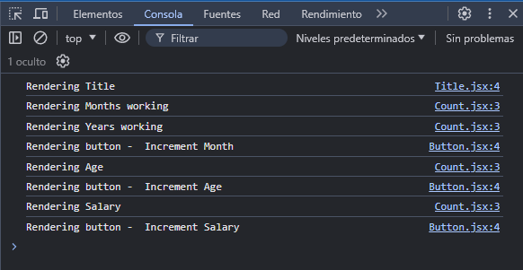

# useMemo

* Cuando necesitamos condicionar la ejecución de una función, para utilizar el valor que devuelve o pasarlo como prop a un componente, utilizamos el hook useMemo.

* Cuando necesitamos condicionar la ejecución de una función, y pasar esta función como un prop a un componente, utilizamos useCallback.

## Problemas de rendimiento

Todos los componentes de una webapp o una página hecha con React se rendrizan por primera vez al iniciar la webapp, abrir la página o actualizar la misma en el navegador. A partir de ahí cada componente, en forma individual, vuelve a renderizarse cuando una variable de estado cambia, o cuando el valor de una prop, que recibe de un padre, cambia.

Cuando un componente vuelve a renderizarse vuelve a crear las variables y funciones que tiene declaradas dentro y vuelve a llamar a sus componentes hijo. Esto genera algunos problemas relacionados con el rendimiento:

* Vuelven a ejecutarse funciones, que devuelven valores, que pueden relentizar el renderizado del componente. (___useMemo___)

* Los componentes vuelven a renderizarse, a menos que indiquemos no hacerlo hasta no presentar un cambio en una variable de estado o una prop. (___React.memo___)

* Las funciones y variables creadas nuevamente, si se pasan como props a otros componentes, hacen que estos componentes vuelvan a renderizarse, ya que están recibiendo nuevas props, aunque estás sean la misma del renderizado anterior. (_useCallback_)

Identificamos estos problemas en el archivo `ParentComponent.jsx`:

```javascriptreact
import { useState } from 'react'
import Count from './Count'
import Button from './Button'
import Title from './Title'

function ParentComponent() {
    const [monthsWorking, setMonthsWorking] = useState(29)
	const [age, setAge] = useState(25)
	const [salary, setSalary] = useState(50000)

	// la función se pasa como prop a un componente hijo, al renderizarse nuevamente el padre la función vuelve a declararse y el componente hijo también vuelve a renderizarse
    const incrementMonths = () => {
        setMonthsWorking(monthsWorking + 1)
    }

	// el valor que devuelve la función se pasa como prop a un componente hijo, al renderizarse nuevamente el padre la función vuelve a declararse y a devolver un valor y el componente hijo también vuelve a renderizarse
    const years = () => {
        let i = 0
		// el código demora en completarse, lo que demora el renderizado del componente
        while (i < 2000000000 ) i++
        return monthsWorking / 12 
    }

	const incrementAge = () => {
		setAge(age + 1)
	}

	const incrementSalary = () => {
		setSalary(salary + 1000)
	}

	return (
		<div>
			{/* el componente Title vuelve a renderizarse cada vez que su padre lo hace, aunque este no recibe ninguna prop */}
			<Title />
            <Count text={"Months working"} count={monthsWorking} />
            <Count text="Years working" count={years()}/>
            <Button handleClick={incrementMonths}>Increment Month</Button>
			<Count text="Age" count={age} />
			<Button handleClick={incrementAge}>Increment Age</Button>
			<Count text="Salary" count={salary} />
			<Button handleClick={incrementSalary}>Increment Salary</Button>
		</div>
	)
}

export default ParentComponent
```

Vamos a notar que al tocar cualquiera de los botones, del código propuesto, la respuesta demora en aparecer, esto es ocasionado por la función `year()`, donde se hace un recorrido de una variable `i` que demora en completarse. Además, en la consola del navegador, vamos a ver el siguiente mensaje cada vez que toquemos alguno de los botones, sin importar cual. Vemos que todos los componentes se están renderizando nuevamente.



## React.memo

Para solucionar el ítem:

* Los componentes vuelven a renderizarse, a menos que indiquemos no hacerlo hasta no presentar un cambio en una variable de estado o una prop.

Utilizamos la función de alto nivel React.memo() en la declaración de los componentes. Con esto indicamos que los mismos solo vuelvan a renderizarse cuando reciban un cambio en sus variables de estado o en sus props.

Editamos el archivo `Title.jsx`:

```javascriptreact
// importamos React para poder llamar a su método memo
import React from 'react'

function Title() {
    console.log('Rendering Title')
    return (
        <h2>
            useCallback Hook
        </h2>
    )
}

// modificamos la declaración del componente
export default React.memo(Title)
```

Editamos el archivo `Button.jsx`:

```javascriptreact
import React from 'react'

function Button({ handleClick, children }) {
    console.log('Rendering button - ', children)
    return (
        <button onClick={handleClick}>
            {children}
        </button>
    )
}

export default React.memo(Button)
```

Editamos el archivo `Count.jsx`:

```javascriptreact
import React from 'react'

function Count({ text, count }) {
	console.log(`Rendering ${text}`)
	return <div>{text} - {count}</div>
}

export default React.memo(Count)
```

Est vez vamos a notar que, cuando tocamos alguno de los botones, en la consola solo aparecen los mensajes de renderizado del botón que tocamos, el componente `Count` que se actualiza mediante ese botón, y los otros botones del código propuesto. Es decir, no se están renderizando el componente `Title`, que no recibe prop, ni los componentes que reciben props pero que las mismas no cambian al tocar el botón.

Probamos con el botón __Increment Month__:


Probamos con el botón __Increment Age__:


## useMemo

Para solucionar el ítem:

* Vuelven a ejecutarse funciones, que devuelven valores, que pueden relentizar el renderizado del componente.

Utilizamos el hook useMemo. Este hook recibe como parámetros una función, que devuelve un valor, y un array de dependencias. La función es lo que debe ejecutarse cuando alguno de los valores del array de dependencias se modifique.

Modificamos `ParentComponent.jsx`:

```javascriptreact
// importamos useMemo
import { useState, useMemo } from 'react'
import Count from './Count'
import Button from './Button'
import Title from './Title'

function ParentComponent() {
    const [monthsWorking, setMonthsWorking] = useState(29)
	const [age, setAge] = useState(25)
	const [salary, setSalary] = useState(50000)

    const incrementMonths = () => {
        setMonthsWorking(monthsWorking + 1)
    }
	
	// la función que recibe useMemo es la que ya veníamos utilizando, la variable years recibe el valor de la división final
    const years = useMemo(() => {
        let i = 0
        while (i < 2000000000 ) i++
        return monthsWorking / 12 
	// si ParentComponent vuelve a renderizarse, la función solo se va a ejecutar si hubo un cambio en el valor de monthsWorking
    }, [monthsWorking])

	const incrementAge = () => {
		setAge(age + 1)
	}

	const incrementSalary = () => {
		setSalary(salary + 1000)
	}

	return (
		<div>
			<Title />
            <Count text={"Months working"} count={monthsWorking} />
			{/* en lugar de llamar a la función y pasar su return a count pasamos el valor de la variable years que obtenemos mediante el hook useMemo */}
            <Count text="Years working" count={years}/>
            <Button handleClick={incrementMonths}>Increment Month</Button>
			<Count text="Age" count={age} />
			<Button handleClick={incrementAge}>Increment Age</Button>
			<Count text="Salary" count={salary} />
			<Button handleClick={incrementSalary}>Increment Salary</Button>
		</div>
	)
}

export default ParentComponent
```

Esta vez, cuando toquemos el botón Increment Month vamos a notar la demora en volver a renderizar los componentes pero, cando toquemos alguno de los otros dos botones, vamos a ver que la carga es inmediata. Esto sucede por que solo al modificar el valor de la variable de estado `monthsWorking` se está ejecutando la función del hook useMemo que devuelve el valor de la variable `years`. La función no se está declarando de nuevo en cada renderizado del componente `ParentComponent`.
