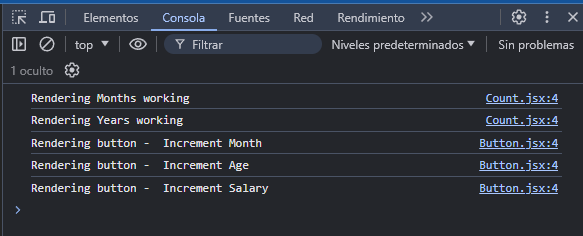
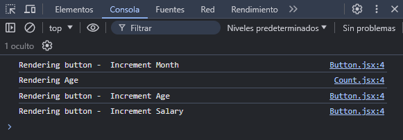
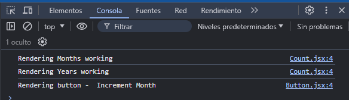
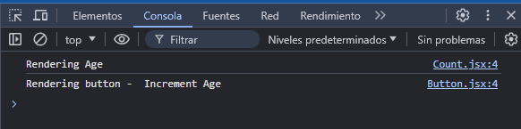

# useCallback

* Cuando necesitamos condicionar la ejecución de una función, para utilizar el valor que devuelve o pasarlo como prop a un componente, utilizamos el hook useMemo.

* Cuando necesitamos condicionar la ejecución de una función, y pasar esta función como un prop a un componente, utilizamos useCallback.

## Problemas de rendimiento

Todos los componentes de una webapp o una página hecha con React se rendrizan por primera vez al iniciar la webapp, abrir la página o actualizar la misma en el navegador. A partir de ahí cada componente, en forma individual, vuelve a renderizarse cuando una variable de estado cambia, o cuando el valor de una prop, que recibe de un padre, cambia.

Cuando un componente vuelve a renderizarse vuelve a crear las variables y funciones que tiene declaradas dentro y vuelve a llamar a sus componentes hijo. Esto genera algunos problemas relacionados con el rendimiento:

* Vuelven a ejecutarse funciones, que devuelven valores, que pueden relentizar el renderizado del componente. (_useMemo_)

* Los componentes vuelven a renderizarse, a menos que indiquemos no hacerlo hasta no presentar un cambio en una variable de estado o una prop. (_React.memo_)

* Las funciones y variables creadas nuevamente, si se pasan como props a otros componentes, hacen que estos componentes vuelvan a renderizarse, ya que están recibiendo nuevas props, aunque estás sean la misma del renderizado anterior. (___useCallback___)

Identificamos estos problemas en el archivo `ParentComponent.jsx`:

```javascriptreact
import { useState, useMemo } from 'react'
import Count from './Count'
import Button from './Button'
import Title from './Title'

function ParentComponent() {
    const [monthsWorking, setMonthsWorking] = useState(29)
	const [age, setAge] = useState(25)
	const [salary, setSalary] = useState(50000)

	// la función se pasa como prop a un componente hijo, al renderizarse nuevamente el padre la función vuelve a declararse y el componente hijo también vuelve a renderizarse
    const incrementMonths = () => {
        setMonthsWorking(monthsWorking + 1)
    }

	// solucionado mediante useMemo
    const years = useMemo(() => {
        let i = 0
        while (i < 2000000000 ) i++
        return monthsWorking / 12 
    }, [monthsWorking])

	const incrementAge = () => {
		setAge(age + 1)
	}

	const incrementSalary = () => {
		setSalary(salary + 1000)
	}

	return (
		<div>
			{/* solucionado mediante React.memo */}
			<Title />
            <Count text={"Months working"} count={monthsWorking} />
            <Count text="Years working" count={years}/>
            <Button handleClick={incrementMonths}>Increment Month</Button>
			<Count text="Age" count={age} />
			<Button handleClick={incrementAge}>Increment Age</Button>
			<Count text="Salary" count={salary} />
			<Button handleClick={incrementSalary}>Increment Salary</Button>
		</div>
	)
}

export default ParentComponent
```

Vamos a notar que, cuando tocamos alguno de los botones, en la consola aparecen los mensajes de renderizado del botón que tocamos, el componente `Count` que se actualiza mediante ese botón, y los otros botones del código propuesto.

Probamos con el botón __Increment Month__



Probamos con el botón __Increment Age__:



## useCallback

Para solucionar el ítem:

* Las funciones y variables creadas nuevamente, si se pasan como props a otros componentes, hacen que estos componentes vuelvan a renderizarse, ya que están recibiendo nuevas props, aunque estás sean la misma del renderizado anterior.

Utilizamos el hook useCallback. Este hook recibe como parámetros una función, que devuelve una función, y un array de dependencias. La función es lo que debe ejecutarse cuando alguno de los valores del array de dependencias se modifique.

Modificamos `ParentComponent.jsx`:

```js
import { useState, useMemo, useCallback } from 'react'
import Count from './Count'
import Button from './Button'
import Title from './Title'

function ParentComponent() {
    const [monthsWorking, setMonthsWorking] = useState(29)
	const [age, setAge] = useState(25)
	const [salary, setSalary] = useState(50000)

	// la función que recibe useCallback es la misma que veníamos utilizando, la variable incrementMonths recibe la función que vamos a pasar como prop a un componente hijo
    const incrementMonths = useCallback(() => {
        setMonthsWorking(monthsWorking + 1)
    }, [monthsWorking])

    const years = useMemo(() => {
        let i = 0
        while (i < 2000000000 ) i++
        return monthsWorking / 12 
    }, [monthsWorking])

	const incrementAge = useCallback(() => {
		setAge(age + 1)
	}, [age])

	const incrementSalary = useCallback(() => {
		setSalary(salary + 1000)
	}, [salary])

	return (
		<div>
			<Title />
            <Count text={"Months working"} count={monthsWorking} />
            <Count text={"Years working"} count={years}/>
			{/* pasamos como prop la función que devuelve useCallback y que guardamos en la variable incrementMonths */}
            <Button handleClick={incrementMonths}>Increment Month</Button>
			<Count text="Age" count={age} />
			<Button handleClick={incrementAge}>Increment Age</Button>
			<Count text="Salary" count={salary} />
			<Button handleClick={incrementSalary}>Increment Salary</Button>
		</div>
	)
}

export default ParentComponent
```

Esta vez vamos a notar que, cuando tocamos alguno de los botones, en la consola solo aparecen los mensajes de renderizado del botón que tocamos y el componente `Count` que se actualiza mediante ese botón.

Probamos con el botón __Increment Month__:



Probamos con el botón __Increment Age__:


